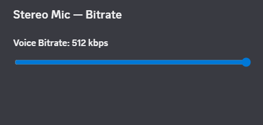

# Stereo Mic

A plugin for **Equicord** / **Vencord** that unlocks stereo microphone transmission on Discord, with live bitrate control and a quick-access button in the voice panel.

> # **Last updated: 30/05/2026**
> Plugin was fully fixed and extended on this date. Stereo, FEC, bitrate override, and the live bitrate button are all working.
>
> ⚠️ Discord updates its voice internals frequently. If something breaks after a Discord update, the patches may need to be adjusted.

---

## What it does

By default, Discord forces your microphone to **mono** and sets the voice bitrate automatically (usually 64–96 kbps). This plugin patches Discord's audio engine to:

- **Send stereo audio** — both left and right channels are transmitted instead of being mixed down to mono. Essential if you use a stereo microphone, Voicemeeter, or any virtual audio cable with a stereo signal.
- **Override the voice bitrate** — lets you push the bitrate up to 512 kbps (Opus codec limit is ~510 kbps) for noticeably higher audio quality, or drop it as low as 8 kbps.
- **Toggle Forward Error Correction (FEC)** — Opus FEC adds redundancy to the audio stream to recover from packet loss on bad connections. Disabled by default because it can cause crackling with stereo audio.

---

## Features

| Feature | Description |
|---|---|
| 🎙️ **Stereo transmission** | Patches Discord's encoder to send 2 channels (L+R) instead of 1 |
| 🎚️ **Adjustable bitrate** | Slider from 8 to 512 kbps, applied live without rejoining the call |
| 🎛️ **Quick bitrate button** | Adds a button next to mute/deafen in the voice panel for instant access |
| 🛡️ **FEC toggle** | Enable/disable Opus Forward Error Correction |

---

## The quick bitrate button

A new **equalizer icon button** appears in the voice control bar (next to mute, deafen, and screen share):


Clicking it opens a small panel with a **live bitrate slider**:



Dragging it changes the bitrate **instantly while you are in a call** — no need to leave and rejoin. The value is also saved and will be used the next time you connect.

---

## Settings

| Setting | Type | Default | Description |
|---|---|---|---|
| **Voice Bitrate** | Slider (8–512 kbps) | `512` | Bitrate for your outgoing voice. Applied live. |
| **Enable FEC** | Toggle | `off` | Forward Error Correction. Helps on bad connections but may cause crackling in stereo. |

> **Tip:** values above ~510 kbps may be clamped by the Opus codec. For maximum quality without risk of rejection, use **510 kbps or lower**.

---

## How to check it is working

1. Enable the plugin and join a voice channel.
2. Open the Discord console (`Ctrl+Shift+I` → Console tab).
3. Filter by `StereoMic` — you should see:
   ```
   [StereoMic] Overriding FEC
   [StereoMic] Overriding Voice Bitrate (From 96kbps to 512kbps)
   ```
   If both lines appear, everything is working correctly.

---

## Installation

1. You need a **source build** of Equicord or Vencord ([setup guide](https://docs.vencord.dev/installing/)).
2. Place this folder inside `src/userplugins/`.
3. Rebuild:
   ```bash
   pnpm build
   ```
4. Fully restart Discord (close from the system tray, not just the window).
5. Enable **Stereo Mic** in Settings → Plugins.

---

## Notes

- Stereo only works if your **input device actually sends a stereo signal**. A regular mono microphone will still sound mono even with this plugin. For true stereo, use a stereo microphone or route audio through **Voicemeeter** / a virtual audio cable configured as stereo.
- The bitrate override has an **~80% reliability rate** — it depends on Discord's internal connection state. If it does not seem to change, try rejoining the call.
- High bitrate + stereo increases your **upload bandwidth** usage.

---

## Credits

[Overocai](https://github.com/Overocai)

## License

GPL-3.0-or-later, matching the Vencord/Equicord project.
